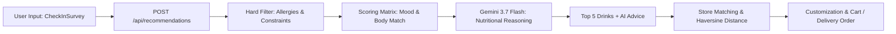

# DailySip Engine — Developer & Assistant Runbook

This skill provides step-by-step guidance, standard operating procedures (SOP), and architecture rules for developing, maintaining, and extending the **DailySip Vietnam** application.

---

## 1. Quick Start & Development Commands

DailySip uses an integrated Express + Vite + TSX architecture.

```bash
# Install dependencies
npm install

# Run full-stack dev server (Express backend + Vite HMR on http://localhost:3000)
npm run dev

# Check TypeScript typing errors
npm run lint

# Build for production
npm run build
```

---

## 2. Core Architecture & Workflow Map



### Key Files:
- [server.ts](file:///c:/Users/bet/hehe/module_3/server.ts): Express API endpoints (`/api/recommendations`, `/api/stores`, `/api/nutritionist-chat`, `/api/home-recipe`).
- [src/types.ts](file:///c:/Users/bet/hehe/module_3/src/types.ts): All TypeScript models and interfaces.
- [src/data/mockData.ts](file:///c:/Users/bet/hehe/module_3/src/data/mockData.ts): Drink catalog, Store locations (GPS), options, and presets.
- [src/App.tsx](file:///c:/Users/bet/hehe/module_3/src/App.tsx): State coordinator, modals, cart, and tab routing.

---

## 3. Standard Procedures

### A. Adding a New Drink to the Catalog
When adding a new drink to `src/data/mockData.ts`:
1. Ensure all required fields from `Drink` interface in `src/types.ts` are populated.
2. Include accurate safety tags:
   - `containsLactose` (true/false)
   - `containsCaffeine` (true/false)
   - `containsNuts` (true/false)
   - `isVegan` (true/false)
   - `isHotAvailable` & `isColdAvailable`
3. Define tags matching available `MoodType`, `BodyStatusType`, and `GoalType`.
4. Include a Vietnamese DIY recipe (`homeRecipe`) and suggested healthy toppings.
5. Map the drink's `id` to relevant stores in `STORES_DATABASE` under `menuItems`.

### B. Adjusting Recommendation & Scoring Logic
Scoring is executed in `server.ts` under `/api/recommendations`:
1. **Hard Filters (Safety)**:
   - Check allergies (`lactose`, `caffeine`, `peanuts`, `vegan`).
   - Check sensitive body conditions (e.g. `caffeine_sensitive` excludes caffeinated items).
2. **Matching Weight Matrix**:
   - `mood`: +25 points per match.
   - `bodyCondition`: +35 to +50 points for direct symptom relief.
   - `preference`: +15 to +25 points (e.g. `low_sugar`, `no_sugar`).
   - `goal`: +30 points.
3. Reference the complete scoring rules in [recommendation-rules.md](./references/recommendation-rules.md).

### C. Modifying Gemini AI Prompts
When updating Gemini prompts in `server.ts`:
- Use model identifier `gemini-3.7-flash`.
- Always provide structured JSON output with `responseMimeType: 'application/json'` when extracting structured fields (`whyItFits`, `wellnessTip`, `caffeineAdvice`, `sugarAdvice`).
- Ensure fallback heuristics remain intact in case `GEMINI_API_KEY` is not provided or network times out.

### D. Adding / Updating Store Coordinates & GPS Routing
- Stores are defined in `STORES_DATABASE`.
- Coordinates must use valid `latitude` and `longitude` in decimal format (e.g. HCMC: `10.7725, 106.6983`).
- Distances are calculated dynamically using the Haversine formula (`calculateDistance`).
- Always maintain external deep-links (`grabFoodUrl`, `shopeeFoodUrl`, `googleMapsUrl`).

---

## 4. Reference Documentation

For detailed specifications, consult the reference guides:
- [Recommendation Rules & Heuristics Matrix](./references/recommendation-rules.md)
- [Data Models & Schema Specifications](./references/data-schemas.md)
