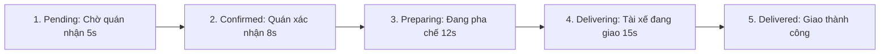

# DailySip Order & Cart Pipeline

Coordinates drink customizations, cart math, voucher discounts, checkout methods, and simulated 5-stage real-time delivery tracking.

## 1. Customization Matrix (`src/components/DrinkCustomizationModal.tsx`)

When a user customizes a beverage before adding to cart:

| Parameter | Options | Price Delta | Constraints |
| :--- | :--- | :--- | :--- |
| **Size** | `S` (-5,000đ), `M` (+0đ), `L` (+8,000đ) | Dynamic | Default `M` |
| **Sugar Level** | `0%`, `30%`, `50%`, `70%`, `100%` | 0đ | Default `50%` (or `30%` if user preferred `low_sugar`) |
| **Ice Level** | `0%`, `30%`, `50%`, `70%`, `100%` | 0đ | Locked to `0%` if `temperature === 'hot'` |
| **Temperature**| `iced` (lạnh), `hot` (ấm nóng) | 0đ | `hot` only selectable if `drink.isHotAvailable === true` |
| **Toppings** | Trân châu hoàng kim (+8k), Hạt chia (+5k), Sương sáo (+6k), Thạch nha đam (+6k) | Sum of toppings | Multi-selectable |
| **Notes** | Free text input (e.g. "Ít ngọt tự nhiên, để riêng đá") | 0đ | Passed to store ticket |

## 2. Cart Financial Calculation (`src/components/CartDrawer.tsx`)

```typescript
// Unit item price with toppings and size adjustments
const itemUnitPrice = (drink.priceVND + sizeAdjustment + toppingsTotal);
const itemTotalPrice = itemUnitPrice * quantity;

// Cart Totals
const subtotal = cart.reduce((acc, item) => acc + item.totalPrice, 0);
const deliveryFee = subtotal >= 150000 ? 0 : 15000;

// Voucher evaluation
let discount = 0;
if (appliedVoucher === 'DAILYSIP50') discount = Math.min(30000, Math.round(subtotal * 0.5));
if (appliedVoucher === 'HEALTHY10') discount = 10000;

const totalAmount = Math.max(0, subtotal + deliveryFee - discount);
```

## 3. Order Lifecycle Simulation (`src/components/OrderTrackingModal.tsx`)

Orders transition through 5 progressive delivery states:



- Driver profile is generated with vehicle type, name, phone, and rating.
- On reaching `delivered`:
  1. Calls `dbService.createOrder(orderData)`.
  2. Clears active cart state in `App.tsx`.
  3. Increments user's `totalOrdersCount` and updates loyalty status.
